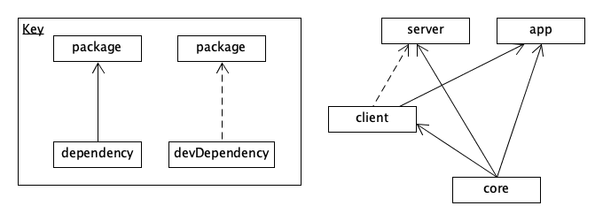

# Table of Contents
- [Project Setup](#Project-Setup)
  - [Software](##Software)
    - [Recommended Software](###Recommended-Software)
    - [Necessary Software](###Necessary-Software)
  - [Getting the Project on Your Machine](##Getting-the-Project-on-Your-Machine)
  - [Running the Project](##Running-the-Project)
- [Folder Structure](#Folder-Structure)

# Project Setup
## Software
### Recommended Software
- Package Manager
  - Mac (or Linux): [homebrew](https://brew.sh/)
  - Windows: [chocolatey](https://chocolatey.org/)
### Necessary Software
- IDE (Below are recommendations)
  - [VS Code](https://code.visualstudio.com) (HIGHLY Recommended)
    - Recommended Extensions
      - ESLint
      - GitLens
      - vscode-icons
  - [Atom](https://atom.io)
- [Node.js](https://nodejs.org/)
  - Brew installation command: `brew install node`
  - Chocolatey installation command: `choco install nodejs`
- [Yarn](https://yarnpkg.com/lang/en/)
  - Brew: `brew install yarn`
  - Choco: `choco install yarn`
- [Git](https://git-scm.com)
  - Brew: `brew install git`
  - Choco: `choco install git.install`
- [MySQL](https://www.mysql.com)
  - Brew: `brew install mysql`
  - Choco: `choco install mysql`

## Getting the Project on Your Machine
- Make sure Sean has added you to the GitLab
- Make an account on the GitLab if you haven't already
- Run `git clone <url>` where `<url>` is the url of the GitLab project
- This should download a copy of the project in a folder called `AffordableServerOSU`

To continue getting set up, please follow additional documentation located in [app](app/README.md) and [server](server/README.md) directories.

## Running the Project
In order to run the project successfully, you must build each component in the correct order based on the dependency tree:



This can be done quickly by running `yarn build` in the root folder of the project.

Instructions for running the front-end can be found [here](app/README.md##Running-The-Front-End).

Instructions for running the back-end can be found [here](server/README.md##Running-The-Back-End).

## (Optional) Configuring a GitLab Runner

This project is set up to use GitLab CI to ensure tests pass and track code coverage. To accomplish this, a [GitLab Runner](https://docs.gitlab.com/runner/) must be configured on a machine that will build and run the tests. To set up the runner:

1. [Download and install the runner for the appropriate system](https://docs.gitlab.com/runner/install/index.html)
2. [Install docker](https://docs.docker.com/install/)
2. [Register](https://docs.gitlab.com/runner/register/index.html) the runner in the GitLab web interface by going to Project Settings -> CI / CD -> Runners -> 
Set up a specific Runner manually
3. Enter the appropriate URL/Token information when running `sudo gitlab-runner register`
4. Choose `docker` as the Runner executor (you must have Docker installed on the local machine)
5. Enter `ubuntu:latest` as the default image.
6. You may need to run `sudo gitlab-runner restart` if it doesn't automatically start.

# Folder Structure
## `app`
- Contains all code related to the React front-end
- For additional information, please take a look at the [README.md](app/README.md) found in `app`
## `core`
- Contains types and classes used by the frontend, backend and client.
## `client`
- Typescript-based client that simplifies using the Affordable Server API
- Used to make REST calls from the frontend to the server
- Used to run integration/end-to-end tests for the server
## `database`
- Contains SQL files to initialize database and definitions for procedures
## `docs`
- Contains documentation created from past teams (probably not up to date)
## `selenium`
- Contains all selenium related code
## `server`
- Contains all code related to back-end
- For additional information, please take a look at the [README.md](server/README.md) found in `server`
## `infra`
- Contains code to orchestrate the AWS and Kubernetes environment.

# AWS commands

Installing and configuring the AWS CLI
```
choco install awscli
aws configure
```
Enter your access key and secret when prompted. When prompted in the region enter `us-east-1`.

# ECR & Docker commands
Authenticating against the registry
`aws ecr get-login-password --region us-east-1 | docker login --username AWS --password-stdin http://330259559134.dkr.ecr.us-east-1.amazonaws.com/affordhealth`

Creating a new image repository
`aws ecr create-repository --repository-name affordhealth/<image_name> --region us-east-1`

Build the frontend image
```sh
cd app
yarn build:no-sourcemap
docker build -t http://330259559134.dkr.ecr.us-east-1.amazonaws.com/affordhealth/app:<YOUR TAG> .
```

Build the backend image
```sh
cd server
yarn compile
docker build -t http://330259559134.dkr.ecr.us-east-1.amazonaws.com/affordhealth/server:<YOUR TAG> -f Dockerfile .. 
```

Build the database image
```
cd database
docker build -t http://330259559134.dkr.ecr.us-east-1.amazonaws.com/affordhealth/db:<YOUR TAG>
```

# Kubernetes commands
To configure Kubernetes using the AWS CLI run the following:
```sh
aws eks --region us-east-1 update-kubeconfig --name affordable-test
```

To test your connection run:
```sh
kubectl get nodes
```

To set the default namespace to `affordable` run
```sh
kubectl config set-context --current --namespace=affordable
```

# Helm commands
To test and debug the templates run:
```sh
helm install --dry-run --debug -f <VALUES_FILE> <RELEASE_NAME> .
```

To apply the configuration to the cluster run:
```sh
helm install -f <VALUES_FILE> <RELEASE_NAME> .
```

To get the different Helm releases in the cluster run:
```sh
helm ls
```

To delete a helm release run:
```sh
helm del <RELEASE_NAME>
```